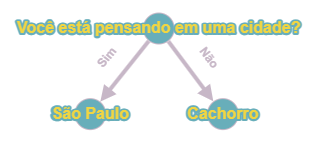

# Projeto de Mini Akinator
O projeto é um jogo de adivinhação, inspirado no jogo Akinator.

No Akinator uma inteligência artifical tenta adivinhar
no que o usúario está pensando realizando perguntas que podem
ser respondidas com "sim", "provalvelmente sim", "não sei",
"provavelmente não" e "não".
Este projeto é similar, com a diferênça que as opções de respostas
são "sim" e "não", e o programa não apresenta uma base de
conhecimentos prévios, assim o jogador deve fornecê-los conforme
joga.

### Dependências
- Java (versão 17 ou superior)

### Como funciona o algoritmo
O algoritmo de adivinhação funciona com uma árvore binária de
decisões, onde a raíz e os galhos representam perguntas, e as
folhas as respostas.

Conforme o usuario responde às perguntas o programa vai navegando
para o próximo nível de profundidade da árvore, e quando atingir
uma folha pergunta se esta representa o que o jogador está pensando,
caso esteja certo o adivinho comemora e o jogo reinicia, mas se
estiver errado o jogo pergunta qual seria a resposta correta e uma
pergunta apropriada para adicionar na árvore, para que no próximo
jogo o algoritmo esteja treinado para adivinhar, e o jogo reinicia.

obs: No estado atual do programa ele não salva os dados, ou seja,
quando encerrar o jogo, todos os dados serão perdidos.

#### Ilustração do algoritmo em ação
Assuma um cenário fictício onde um usuário está pensando na cidade de
Maceió e a imagem abaixo representa o estado inicial do programa.

Então as escolhas realizadas por ele será "sim" para a primeira pergunta
e "não" para a resposta São Paulo, então ele irá inserir a pergunta "Esta
cidade fica na região nordeste?" e a resposta Maceio. Após isso,
será atribuído como resposta da escolha afirmativa a nova resposta e a
antiga será colocada no caso negativo, ficando como na imagem abaixo:

Imagine agora que o usuário está pensando na cidade de Salvador,
assim a sequência das respostas dele será "sim", "sim" e "não". Da mesma
forma como no caso anterior, o jogador insere uma pergunta e o que ele
estava pensando. O estado da árvore atual é representado como:

Fim da execução do programa!

### To do
- adicionar sistema de salvar e recuperar dados. 

### Bugs resolvidos
- (07/10/2024) - Reiniciando antes da hora; Mexi na lógica de reiniciar
- (06/10/2024) - Ponteiro nulo do objeto "raiz" clonado; Identificado erro no construtor
da classe NoDecisaoBinaria
- (06/10/2024) - Variável "atual" da classe ArvoreBinariaDecisao manipulando a variável
"raiz" diretamente; Corrigido referenciando "atual" a um clone do objeto
"raíz"